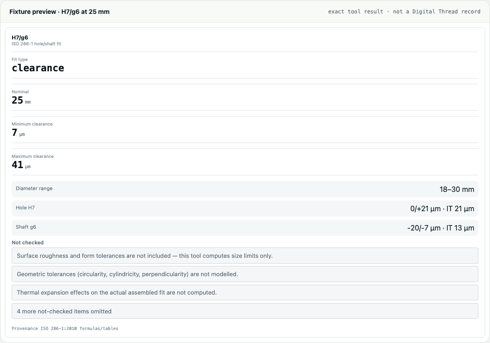

# @casys/mcp-tolerance

[](https://jsr.io/@casys/mcp-tolerance)
[](https://github.com/Casys-AI/mcp-tolerance/actions/workflows/publish.yml)
[](LICENSE)

Deterministic ISO 286-1:2010 size-tolerance calculations and linear 1D stack-ups,
available as an MCP server and a Deno library.

Give it `H7/g6` at 25 mm and it reports the actual dimensional relationship:

| Member    |           Limits |
| --------- | ---------------: |
| Hole H7   | 25.000–25.021 mm |
| Shaft g6  | 24.980–24.993 mm |
| Clearance |   0.007–0.041 mm |

It calculates; it does not inspect a part, choose a fit for an application, or declare a
design conformant.



<sub>Fixture preview generated through the real bundled viewer and exact tool result. It
is a demo surface, not a recorded Digital Thread result or a verdict.</sub>

## Start it

### Desktop / stdio

```bash
deno run \
  --allow-env \
  --allow-read=mcp-server.yaml \
  --allow-net=jsr.io \
  jsr:@casys/mcp-tolerance@0.3.4/server \
  --stdio
```

Minimal MCP client configuration:

```json
{
  "mcpServers": {
    "tolerance": {
      "command": "deno",
      "args": [
        "run",
        "--allow-env",
        "--allow-read=mcp-server.yaml",
        "--allow-net=jsr.io",
        "jsr:@casys/mcp-tolerance@0.3.4/server",
        "--stdio"
      ]
    }
  }
}
```

### Stateless HTTP

```bash
deno run \
  --allow-env \
  --allow-read=mcp-server.yaml \
  --allow-net=127.0.0.1:3019,jsr.io \
  jsr:@casys/mcp-tolerance@0.3.4/server \
  --port=3019
```

The endpoint is `http://127.0.0.1:3019/mcp` and speaks the stateless MCP `2026-07-28`
contract.

### Container

```bash
docker run --rm -p 127.0.0.1:3019:3019 \
  ghcr.io/casys-ai/mcp-tolerance:0.3.4 http
```

Use `stdio` instead of `http` for an interactive container client. Version tags and
`latest` are convenient selectors; pin the published OCI digest when the deployment
itself must be reproducible.

## What it covers

- IT grades and supported hole/shaft limit classes over `(0, 500]` mm.
- Hole-basis and general hole/shaft fit analysis with signed clearance ranges.
- Scalar 1D chains with worst-case and RSS intervals plus reconstructable contributor
  terms.

Every result carries provenance, explicit `not_checked` limits, and no invented
pass/fail verdict. The complete class coverage, sign conventions, formulas, stack-up
assumptions, and exclusions live in the
[technical reference](docs/technical-reference.md).

## MCP Apps

MCP Apps-capable hosts receive compact provider-owned surfaces for limits, fits, and
stack-ups. Text-only hosts keep the same `content` and `structuredContent`.

The package exports `@casys/mcp-tolerance/view-app-manifest`, which declares the
whole-view resources and their read-only `viewer.session.apply` contracts. A recording
host may replay an exact projection; this provider does not create a Digital Thread
session, anchor, approval, or manufacturing claim.

## Library

```bash
deno add jsr:@casys/mcp-tolerance@0.3.4
```

```ts
import { computeFit, fundamentalTolerance } from "@casys/mcp-tolerance";

console.log(fundamentalTolerance(7, 25)); // 21 µm
console.log(computeFit("H7", "g6", 25).fit); // clearance, 7–41 µm
```

## Documentation

- [Technical reference](docs/technical-reference.md) — contracts, classes, formulas,
  signs, stack-ups, boundaries, and verification.
- [Running and contributing](docs/running-and-contributing.md) — transports, containers,
  viewer builds, release gates, and deployment safety.
- [Security policy](SECURITY.md) · [Changelog](CHANGELOG.md) · [Citation](CITATION.cff)

For a checkout, the short validation path is:

```bash
deno task test
deno task release:check
```

MIT licensed. This project references ISO 286-1:2010 but is not an official ISO
publication or certification service.
